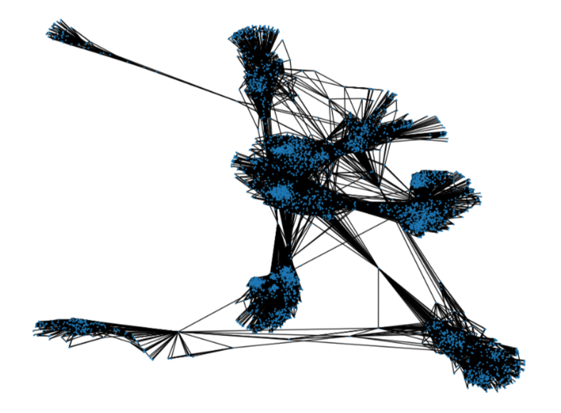

# Dynamics in signed threshold networks
## Il Problema

Il problema del Dynamics in signed threshold networks consiste nel trovare all'interno di una signed network, ovvero una rete utilizzata per modellare e analizzare reti sociali complesse in cui le relazioni possono essere sia positive che negative, un insieme di nodi k che possa massimizzare il numero di vertici attivi all'interno della rete. 

Formalmente una signed network può essere modellata come un grafo non direzionato G = (V, E+ U E-), dove per ogni coppia di vertici u e v del grafo:
- (u,v) ∈ E+ significa che c’è una interazione **positiva** tra u e v
- (u,v) ∈ E- significa che c’è una interazione **negativa** tra u e v 

Per ogni vertice v della rete è stato assegnato un valore **threshold** costante, dove quest’ultimo è definito come il numero minimo di adiacenti di v necessari per influenzare tale nodo. 

Il problema dell'influenza sociale si riferisce al processo in cui un individuo modifica le proprie opinioni o comportamenti attraverso l'interazione con altre persone. L'obiettivo di questa attività progettuale è trovare il numero minimo di nodi che possono influenzare tutti gli altri nodi nella rete. Questi nodi costituiscono l'insieme di seed set.

L’idea di questa attività progettuale è quella di trovare il numero di persone minimo che possano influenzare tutte le altre.  Rapportando questo problema con i grafi e le reti sociali, bisogna trovare il numero minimo di nodi che riescano ad influenzare l’intera rete. I nodi che rispettano tali condizioni vengono inseriti in un insieme che viene chiamato **Seed Set**.  

Più formalmente, quindi, il problema della diffusione dell’influenza può essere descritto nel seguente modo:  
Data una rete G = (V,E), una funzione di threshold t:V -> {1,2, …} ed un seed set S ⊆ V, un processo dinamico di diffusione dell’influenza è definita come la sequenza di un sottoinsieme di nodi:  
Influenced[S, 0] , Influenced[S, 1] , …, Influenced[S, r] , …,  ⊆ V 
 
dove: 

- Influenced[S, 0] = S 
- Influenced[S, r] = Influenced[S, r- {v : |N(v)    Influenced[S, r-  t(v)} con N(v) = insieme di nodi adiacenti di v 

Il lavoro da noi svolto ha dunque l’obiettivo di confrontare, a partire da una signed networks, diversi algoritmi per la determinazione del seed set, e valutare quali tra questi offre performance migliori per quanto riguarda la massimizzazione dell’influenza sull’intera rete.  

Il tutto può essere riassunto nei seguenti step:  

- Dato un grafo G=(V,E) ed una threshold function t: V -> {1,2,…}, 
- Dato un intero k,
- Data una distribuzione di probabilità associata agli archi di G p:E -> [0,1] I. 	Si costruisce Gp = (V, E+ U E-) 
- Si applica Algorithm x (2 dei 4 algoritmi che sono stati forniti + l’algoritmo da noi ideato) per determinare il seed set Sp  con | Sp | = k 
- Si fa girare il processo di attivazione e si determina l’insieme dei nodi attivati Inf[Sp] 
- Si ripetono per 10 volte gli step 1. 2. e 3. E viene poi calcolata la media 𝝈 della size dell’insieme dei nodi attivati 

## La Rete Scelta

La rete scelta è “ego-Facebook”, una delle reti messe a disposizione da SNAP (Stanford Network Analysis Project) all’interno del loro repository pubblico. 
Il dataset scelto consiste nelle “cerchie” (o friend-lists) di Facebook. I dati sono stati raccolti tramite i partecipanti ad un sondaggio utilizzando l’app di Facebook. Il dataset include le caratteristiche dei nodi (profili), le cerchie e gli ego networks, ovvero reti costituite di un nodo focale (“ego”), dei nodi ai quali l’ego è direttamente connesso (detti “alters”) e dei collegamenti, se presenti, tra gli alters. 
I dati sono stati anonimizzati rimpiazzando gli id interni di Facebook con un nuovo valore. Inoltre, dal momento che sono stati forniti i vettori contenenti le varie features di questo dataset, l’interpretazione di queste caratteristiche è stata anonimizzata. Per esempio, dove nel dataset originale era presente la  caratteristica “political=Democratic Party”, il nuovo valore per questa feature conterrebbe semplicemente “political=anonymized feature 1”. Con i dati anonimizzati, è possibile determinare se due utenti hanno le stesse affiliazioni politiche, ma non è possibile sapere le effettive affiliazioni dei singoli individui. 

  

  

La scelta di questa rete è stata basata sulla sua densità di connessioni, la presenza di comunità ben connesse al loro interno e la possibilità di modellare relazioni positive e negative tra i nodi.

## Dettagli Implementativi

Per l'implementazione di questo progetto, è stato utilizzato il linguaggio Python e il modulo Snap.py per l'analisi del grafo. I seguenti passaggi sono stati seguiti:

1. Caricamento del grafo utilizzando la funzione LoadEdgeList() di SNAP per importare il grafo da un file di testo.
2. Etichettatura degli archi del grafo come positivi o negativi basata su una distribuzione di probabilità associata ad ogni arco.
3. Implementazione di tre algoritmi per la determinazione del seed set: Seeds-Greedy-Difference max, Target-Set-Selection e Seed Set Community Detection.
4. Utilizzo della funzione di cascata per influenzare l'intera rete a partire dal seed set identificato.

## Esecuzione dell'esperimento

L'esperimento è stato ripetuto per 10 volte seguendo i seguenti passaggi:

1. Dato un grafo G=(V,E) e una funzione di threshold t: V -> {1,2,...}.
2. Dato un intero k.
3. Creazione di una distribuzione di probabilità associata agli archi di G.
4. Applicazione di uno dei tre algoritmi per determinare il seed set Sp con |Sp| = k.
